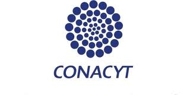

# RegulonDB Funding

The development of RegulonDB is funded by:

- The National Autonomous University of Mexico (UNAM) at the Center for Genomic Sciences.

- The National Institutes of Health (NIH) National Center of General Medical Sciences:  
 
   - RegulonDB Development: GM071962,   
   - RegulonDB Curation: RegulonDB grant GM071962 and EcoCyc grant GM077678.  
   - New grants numbers GM077678 and 5RO1GM131643.   

- Consejo Nacional de Ciencia y Tecnologia (CONACyT), Mexico (83686 G.I., CB2008-103686-Q, PROINNOVA-134817) and Funding for open access charge: Consejo Nacional de Ciencia y Tecnologia (CONACyT), Mexico (CB2008-103686-Q). 

 

<head>
  <meta charset="UTF-8">
  <title>Tabla con imágenes</title>
  <style>
    table {
      width: 60%;
      border-collapse: collapse;
      margin: 30px auto;
    }
    td {
      border: none;
      padding: 10px;
      text-align: center;
    }
    img {
      max-width: 100%;
      height: auto;
    }
</head>

 <table style="border:0px">
  <tr>
    <th></th>
    <th></th>
    <th></th>
  </tr>
 </table> 

