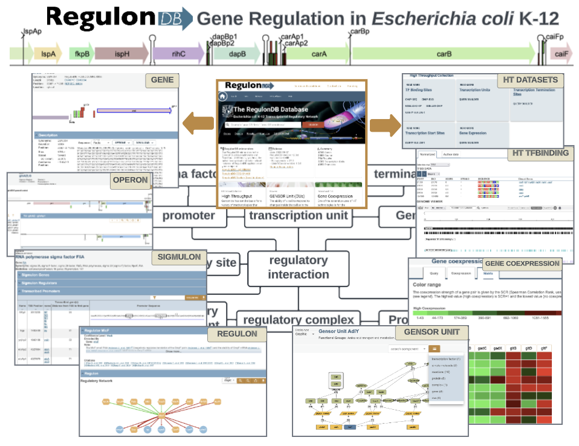

# What is RegulonDB?

**RegulonDB** is a comprehensive and expertly curated knowledge base dedicated to the transcriptional regulatory network of *Escherichia coli* K-12, a model organism in molecular biology and systems biology. It has been developed and maintained by the *Computational Genomics Program* at the **Centro de Ciencias Genómicas (UNAM)** for over two decades.

## 🎯 Purpose and Mission

RegulonDB provides a **gold-standard reference** of experimentally supported regulatory elements in *E. coli*, serving as a reliable resource for:

- Understanding the architecture of bacterial gene regulation
- Supporting the development and validation of computational models
- Enabling reproducible and interoperable analyses in genomics

Its mission is to organize and disseminate high-quality regulatory knowledge in a structured, computable format that meets the needs of both experimental and computational researchers.

## 📦 What It Contains

RegulonDB integrates detailed information on:

- Genes, operons, promoters, and transcription units  
- Transcription factors (TFs) and their binding sites  
- Regulatory interactions and transcription start sites (TSSs)  
- **GENSOR Units** — signal-to-response modules linking environmental signals, TFs, regulated genes, and their functional outcomes  

Each item is annotated with specific **evidence codes**, capturing the method (e.g., EMSA, footprinting, RNA-seq, ChIP-seq) and strength of support (strong, weak, confirmed). Data are derived from peer-reviewed scientific literature and undergo manual curation by domain experts.

## 🔬 Curation and Methodology

RegulonDB follows a robust, transparent data lifecycle that includes:

- Extraction of regulatory data from primary literature  
- Normalization and quality control of molecular entities  
- Annotation using **controlled vocabularies** and **biological ontologies**  
- Traceability to experimental conditions and original publications  

The database distinguishes between classical and high-throughput (HT) data, integrating HT results (e.g., TSSs, TFBSs from ChIP-seq) only when they meet criteria for functional relevance or cross-validation.

## 🧠 Scientific and Technological Impact

With over **2,400 citations** in **more than 600 journals**, RegulonDB is a cornerstone in:

- 🧬 Systems biology and network inference  
- 🧠 Gene expression and promoter analysis  
- 🤖 Machine learning and AI model validation  
- 🧪 Synthetic biology and bioengineering  
- 📊 Comparative genomics and predictive modeling  

It is used globally by researchers in **microbiology**, **bioinformatics**, **computational biology**, **data science**, and **education**, and it plays a central role in validating tools, training models, and benchmarking pipelines.

## 🌐 Access and Tools

RegulonDB provides:

- A user-friendly **web interface** with interactive visualizations  
- Advanced search and query tools  
- **Downloadable datasets** for both curated and HT data  
- **Integration with external databases** such as EcoCyc  
- Support for **APIs** and reproducible workflows  

The database is maintained with frequent updates and remains aligned with community standards.

## 🔁 FAIR Principles

RegulonDB adheres to the **FAIR principles**:

- **Findable**: Persistent identifiers, structured metadata  
- **Accessible**: Open-access data and downloadable content  
- **Interoperable**: Use of standardized vocabularies and formats  
- **Reusable**: Clear licensing, provenance, and evidence-level tagging  

---

RegulonDB continues to evolve as a foundational tool for decoding gene regulation and as a driver of innovation in computational biology and beyond.

