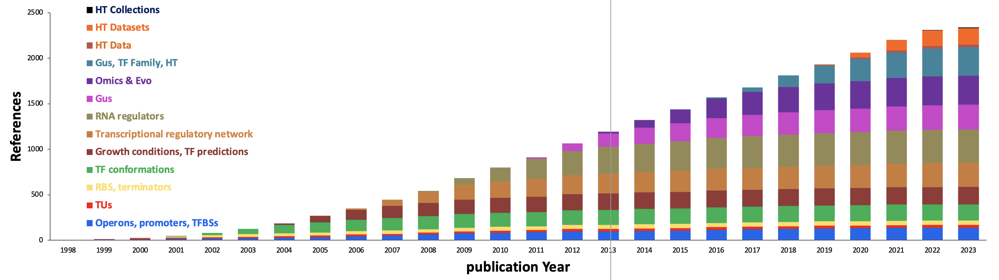

# Impact of RegulonDB

RegulonDB is the gold standard resource on regulation of transcription initiation that integrates the scattered scientific knowledge of the best-characterized organism, the bacterium Escherichia coli K-12. Its electronic format enables researchers to compare their results with the legacy of previous knowledge and supports implementation of bioinformatics tools and model building.

RegulonDB plays a central role in the development and testing of novel approaches of gene regulation in bioinformatics, comparative genomics and systems biology, and is the model to inspire similar approaches and studies for any other organism, including pathogenic bacteria ((Shen-Orr et al., 2002), (Barabasi and Oltvai, 2004), (Isalan et al., 2008) ). Evidence of its usefulness is the more than 1200 citations in published articles, in addition to the many citations to the EcoCyc database, which incorporates our curation work. 

Accumulated citations per RegulonDB papers by year and the concomitant expansion of domains of the biology that we keep addressing. 

| Reference Title | Year |
|:-- |:-- |
| RegulonDB: a database on transcriptional regulation in Escherichia coli. | 1998 |
| RegulonDB (version 2.0): a database on transcriptional regulation in Escherichia coli | 1999 |
| RegulonDB (version 3.0): transcriptional regulation and operon organization in Escherichia coli K-12 | 2000 |
| RegulonDB (version 3.2): transcriptional regulation and operon organization in Escherichia coli K-12 |	2001 |
| RegulonDB (version 4.0): transcriptional regulation, operon organization and growth conditions in Escherichia coli K-12 | 2004 |
| RegulonDB (version 5.0): Escherichia coli K-12 transcriptional regulatory network, operon organization, and growth conditions | 2006 |
| RegulonDB (version 6.0): gene regulation model of Escherichia coli K-12 beyond transcription, active (experimental) annotated promoters and Textpresso navigation |2008 |
| RegulonDB version 7.0: transcriptional regulation of Escherichia coli K-12 integrated within genetic sensory response units (Gensor Units) | 2011 |
| RegulonDB v8.0: omics data sets, evolutionary conservation, regulatory phrases, cross-validated gold standards and more | 2013 |
| RegulonDB version 9.0: high-level integration of gene regulation, coexpression, motif clustering and beyond | 2016 |
| A unified resource for transcriptional regulation in Escherichia coli K-12 | 2018 |
| RegulonDB v 10.5: tackling challenges to unify classic and high throughput knowledge of gene regulation in E. coli K-12  | 2019 |
| RegulonDB 11.0: Comprehensive high-throughput datasets on transcriptional regulation in Escherichia coli K-12 	|2022|
 
 
 
 - Isalan, M., C. Lemerle, K. Michalodimitrakis, C. Horn, P. Beltrao, E. Raineri, M. Garriga-Canut and L. Serrano (2008). "Evolvability and hierarchy in rewired bacterial gene networks". Nature. 452(7189): 840-U842.
 - Barabasi, A. L. and Z. N. Oltvai (2004). "Network biology: Understanding the cell's functional organization". Nature Reviews Genetics. 5(2): 101-U115.
 - Shen-Orr, S. S., R. Milo, S. Mangan and U. Alon (2002). "Network motifs in the transcriptional regulation network of Escherichia coli". Nature Genetics. 31(1): 64-68.
