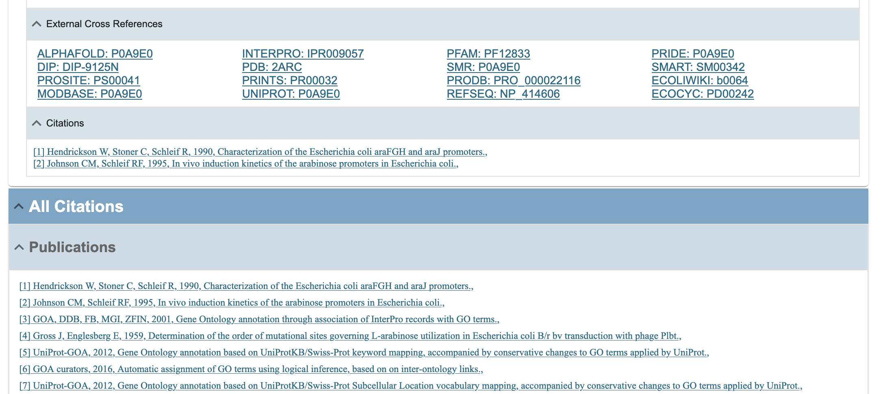
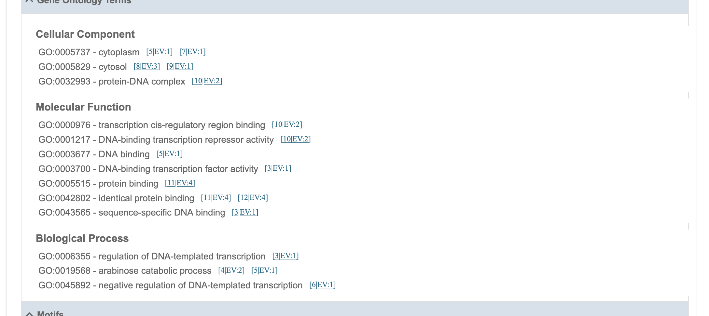
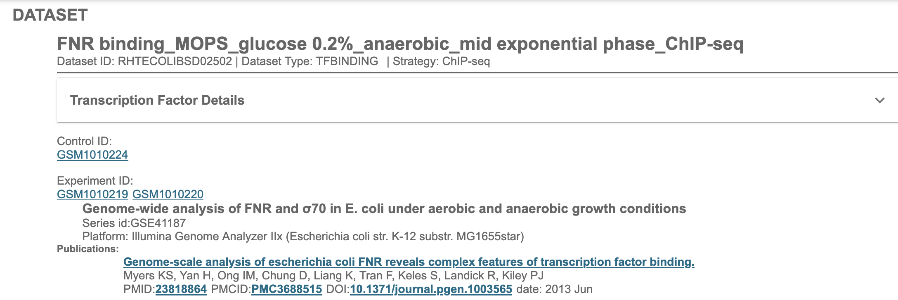
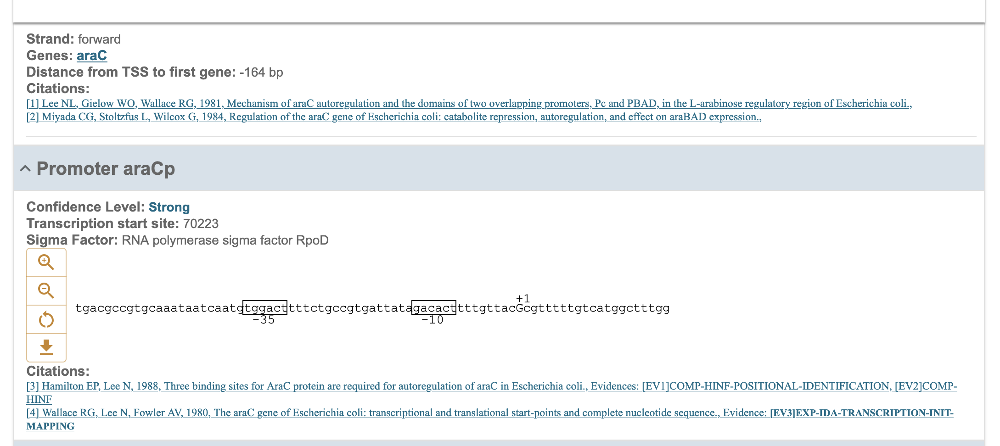
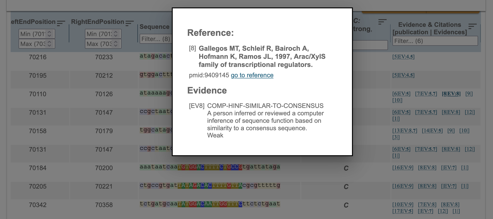

# Cross-Database Relationships in RegulonDB

This document summarizes how **RegulonDB** connects with other biodata resources through curated hyperlinks and data dependencies, based on visual evidence from several internal web pages.

 

## 1. External Cross References on Gene Pages

*Figure. Gene web page with links to external references.*

Each gene entry in RegulonDB includes a panel of outbound links to major protein and genomic data resources. For example:

- **UniProt** (e.g., `P0A9E0`): for protein-level annotation
- **RefSeq** (e.g., `NP_414606`): for nucleotide and protein sequences
- **ECOLIWIKI**, **EcoCyc**, **MODBASE**, **PFAM**, **SMART**, **InterPro**, **PROSITE**, **DIP**, **PDB**, and others

These links are manually curated to ensure each gene or protein record in RegulonDB remains synchronized with corresponding entities across specialized databases.

 

## 2. Gene Ontology (GO) Integration

*Figure. Gene web page with GO terms.*

Gene pages in RegulonDB display structured **Gene Ontology (GO)** terms categorized into:  

- **Cellular Component**
- **Molecular Function**
- **Biological Process**

Each GO term is linked to external references or sources (e.g., `UniProt-GOA`, `MGI`, `FB`, `ZFIN`, etc.). These associations are curated and often include evidence codes and publication support, indicating **interoperability with the GO Consortium's ecosystem**.

 

## 3. High-Throughput Datasets and GEO Links

*Figure. HT Dataset web page with links to GEO database.*

High-throughput (HT) datasets in RegulonDB reference original experimental data from repositories such as **GEO (Gene Expression Omnibus)**. For instance:

- **Control and experiment IDs** like `GSM1010224` and `GSM1010220`. 
- Associated GEO **series ID** (e.g., `GSE41187`). 

These ensure data provenance and traceability, connecting RegulonDB entries directly with the raw data hosted externally.

 

## 4. Literature References to PubMed

*Figure shows the Operon web page with citations and links to pubmed*

*Figure shows the Regulon web page with citations and links to pubmed*

Most curated biological objects in RegulonDB (operons, promoters, regulons, regulatory interactions, transcription units, terminators, etc.. ) include direct links to **PubMed** entries that provide the experimental or review evidence behind them. These links:

- Validate the scientific source of the data
- Provide full citation transparency
- Enable researchers to trace curated entries back to the original publications

 

## 5. Community Engagement and Collaboration

If your database or resource contains regulatory information that could be linked from RegulonDB, we welcome collaboration. Please contact us through the official **RegulonDB contact form** or email to suggest integration:

👉 https://regulondb.ccg.unam.mx/manual/aboutUs/contact-us

We are committed to expanding our interoperability network and enriching the regulatory landscape in microbial genomics.

 

## Summary

RegulonDB is deeply integrated into the global network of biological databases. It:
- Reuses curated knowledge from authoritative external resources
- Provides persistent links back to those sources
- Offers its own structured, curated content to be reused in platforms like **EcoCyc**, **UniProt**, **GO**, and **GEO**

These relationships support **FAIR data principles**, enhance **interoperability**, and position RegulonDB as a reliable node in the ecosystem of biodata resources.
